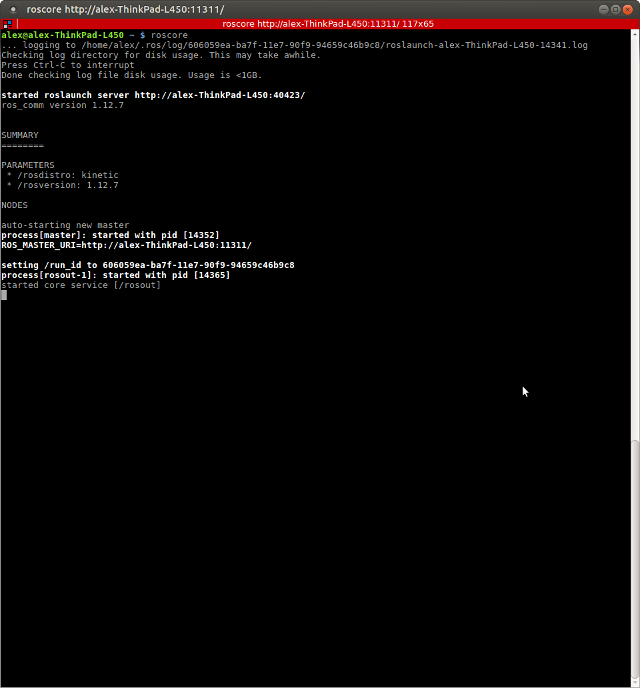
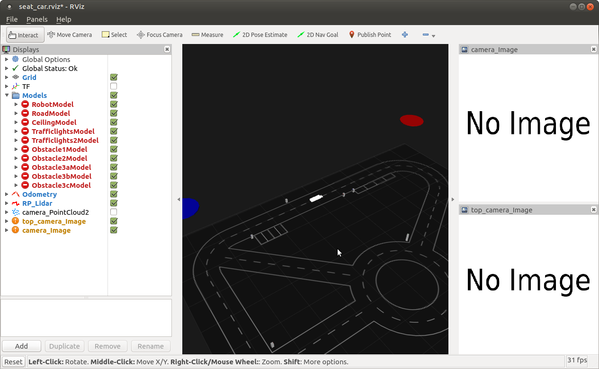
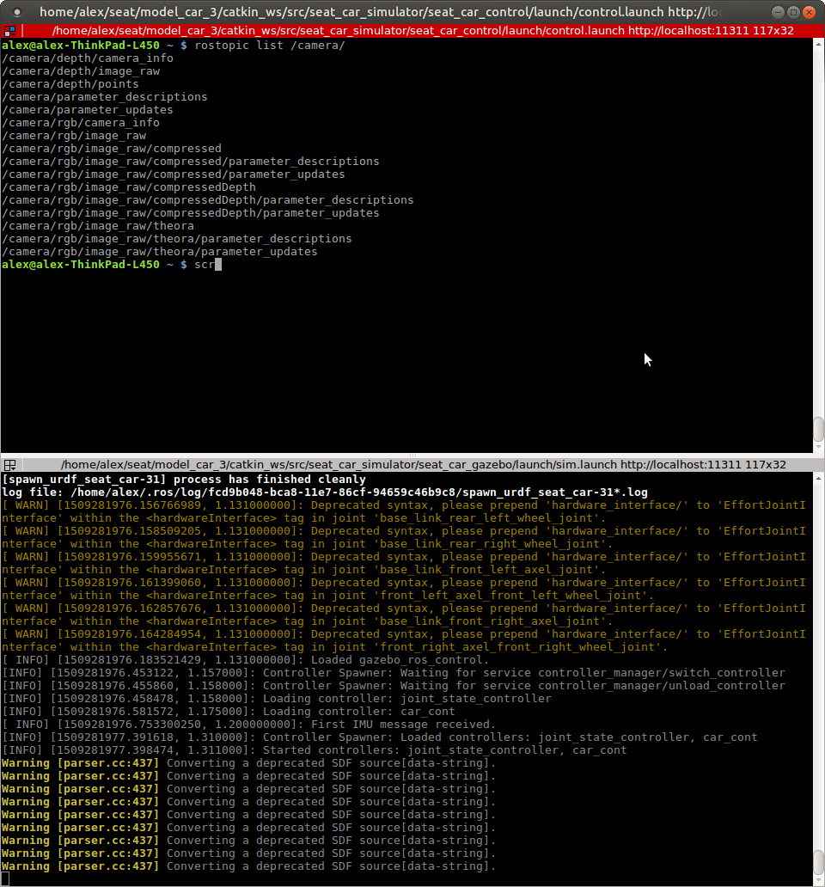
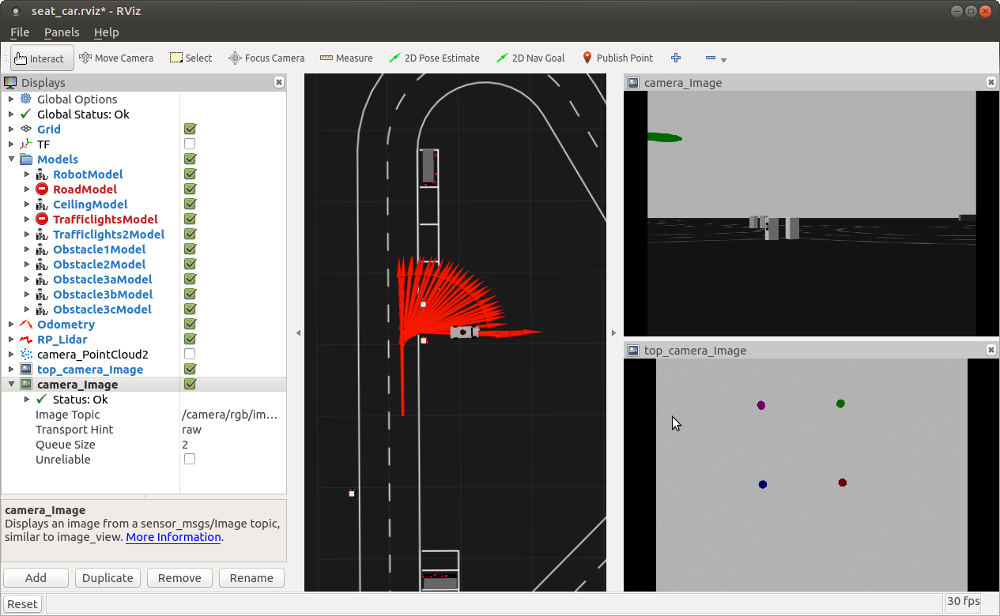
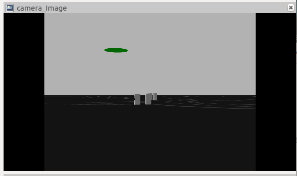

# Robotik WS 17/18 - UB1
* Alexander Hinze-Hüttl - hinze.alex@gmail.xom - 4578322


Habe bisher leider noch keinen Übungspartner gefunden.

### 1. ROS Installation


`roscore`



### 2. Gazebo and model car



### 3. ROS topics and Moving the Simulated car

`rostopic list /camera/`








`rostopic list`

```
/camera/depth/camera_info
/camera/depth/image_raw
/camera/depth/points
/camera/parameter_descriptions
/camera/parameter_updates
/camera/rgb/camera_info
/camera/rgb/image_raw
/camera/rgb/image_raw/compressed
/camera/rgb/image_raw/compressed/parameter_descriptions
/camera/rgb/image_raw/compressed/parameter_updates
/camera/rgb/image_raw/compressedDepth
/camera/rgb/image_raw/compressedDepth/parameter_descriptions
/camera/rgb/image_raw/compressedDepth/parameter_updates
/camera/rgb/image_raw/theora
/camera/rgb/image_raw/theora/parameter_descriptions
/camera/rgb/image_raw/theora/parameter_updates
/ceiling/joint_states
/clock
/gazebo/link_states
/gazebo/model_states
/gazebo/parameter_descriptions
/gazebo/parameter_updates
/gazebo/set_link_state
/gazebo/set_model_state
/imu
/imu/accel/parameter_descriptions
/imu/accel/parameter_updates
/imu/bias
/imu/data
/imu/rate/parameter_descriptions
/imu/rate/parameter_updates
/imu/yaw/parameter_descriptions
/imu/yaw/parameter_updates
/imu_filter/parameter_descriptions
/imu_filter/parameter_updates
/manual_control/speed
/manual_control/steering
/manual_control/stop_start
/model_car/revolutions
/model_car/twist
/model_car/yaw
/obstacle1/amcl_pose
/obstacle1/cmd_vel
/obstacle1/initialpose
/obstacle1/joint_states
/obstacle1/odom
/obstacle2/amcl_pose
/obstacle2/cmd_vel
/obstacle2/initialpose
/obstacle2/joint_states
/obstacle2/odom
/obstacle3a/amcl_pose
/obstacle3a/cmd_vel
/obstacle3a/initialpose
/obstacle3a/joint_states
/obstacle3a/odom
/obstacle3b/amcl_pose
/obstacle3b/cmd_vel
/obstacle3b/initialpose
/obstacle3b/joint_states
/obstacle3b/odom
/obstacle3c/amcl_pose
/obstacle3c/cmd_vel
/obstacle3c/initialpose
/obstacle3c/joint_states
/obstacle3c/odom
/odom
/odom_ground_truth
/particlecloud
/road/joint_states
/rosout
/rosout_agg
/scan
/seat_car/amcl_pose
/seat_car/car_cont/gains/base_link_front_left_axel_joint/parameter_descriptions
/seat_car/car_cont/gains/base_link_front_left_axel_joint/parameter_updates
/seat_car/car_cont/gains/base_link_front_right_axel_joint/parameter_descriptions
/seat_car/car_cont/gains/base_link_front_right_axel_joint/parameter_updates
/seat_car/car_cont/gains/base_link_rear_left_wheel_joint/parameter_descriptions
/seat_car/car_cont/gains/base_link_rear_left_wheel_joint/parameter_updates
/seat_car/car_cont/gains/base_link_rear_right_wheel_joint/parameter_descriptions
/seat_car/car_cont/gains/base_link_rear_right_wheel_joint/parameter_updates
/seat_car/car_cont/gains/front_left_axel_front_left_wheel_joint/parameter_descriptions
/seat_car/car_cont/gains/front_left_axel_front_left_wheel_joint/parameter_updates
/seat_car/car_cont/gains/front_right_axel_front_right_wheel_joint/parameter_descriptions
/seat_car/car_cont/gains/front_right_axel_front_right_wheel_joint/parameter_updates
/seat_car/initialpose
/seat_car/joint_states
/semaphore_intersection1_color_plugin/set_color
/semaphore_intersection1_color_plugin/set_material
/semaphore_intersection2_color_plugin/set_color
/semaphore_intersection2_color_plugin/set_material
/semaphore_intersection3_color_plugin/set_color
/semaphore_intersection3_color_plugin/set_material
/semaphore_parking1_color_plugin/set_color
/semaphore_parking1_color_plugin/set_material
/semaphore_parking2_color_plugin/set_color
/semaphore_parking2_color_plugin/set_material
/semaphore_roundabout1_color_plugin/set_color
/semaphore_roundabout1_color_plugin/set_material
/semaphore_roundabout2_color_plugin/set_color
/semaphore_roundabout2_color_plugin/set_material
/semaphore_start1_color_plugin/set_color
/semaphore_start1_color_plugin/set_material
/semaphore_start2_color_plugin/set_color
/semaphore_start2_color_plugin/set_material
/tf
/tf_static
/trafficlights_extra_example/joint_states
/trafficlights_fixed/joint_states
/usb_cam/camera_info
/usb_cam/image_raw
/usb_cam/image_raw/compressed
/usb_cam/image_raw/compressed/parameter_descriptions
/usb_cam/image_raw/compressed/parameter_updates
/usb_cam/image_raw/compressedDepth
/usb_cam/image_raw/compressedDepth/parameter_descriptions
/usb_cam/image_raw/compressedDepth/parameter_updates
/usb_cam/image_raw/theora
/usb_cam/image_raw/theora/parameter_descriptions
/usb_cam/image_raw/theora/parameter_updates
/usb_cam/parameter_descriptions
/usb_cam/parameter_updates
```
