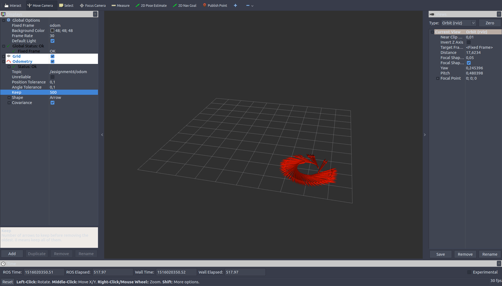

# Robotiks WS17/18

# Assignment 10

| Name | MatrNr | Mail |
|------|----------|-----|
| Sven Heinrichsen | 4780388 | s.heinrichsen@fu-berlin.de |
| Alexander Hinze-Huettl | 4578322 | hinze.alex@gmail.com |

__Repo:__ [https://github.com/al-eax/robotik_ws1718](https://github.com/al-eax/robotik_ws1718)

## 1 - Load the _matrixDynamic_ and find the steering angle

### a,b)

We placed our car on three diffrent positions on the field.
We calculated the steering angle and let the car drive a circle on `matrixDynamic_lane1.npy`

* __Position 1__:
`x,y,yaw = (3.0824503810121322, 3.4432021842017404, -3.428323751982624)`

* __Position 2__:
`x,y,yaw = (2.4863752403013173, 2.5317883165130555, -0.71667885419037469)`

* __Position 3__:
`x,y,yaw = (3.9662325573582558, 0.6006136280417349, -2.8916016620543497)`

Finnaly we used `plot_desired_steering.py` to plot the circles:

## 2 - Navigation using the force matrix

We used the `controller.py` from the repo and used the example solution from kvv for virusl gps. Our car drives the on the lane:

