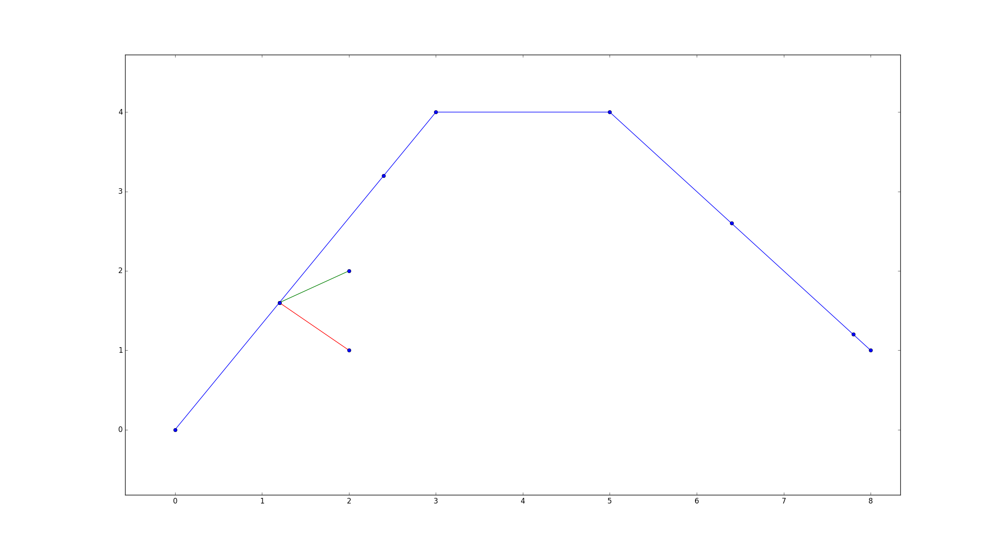
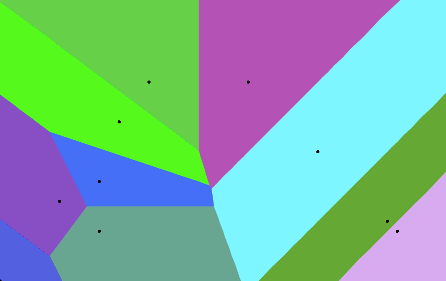
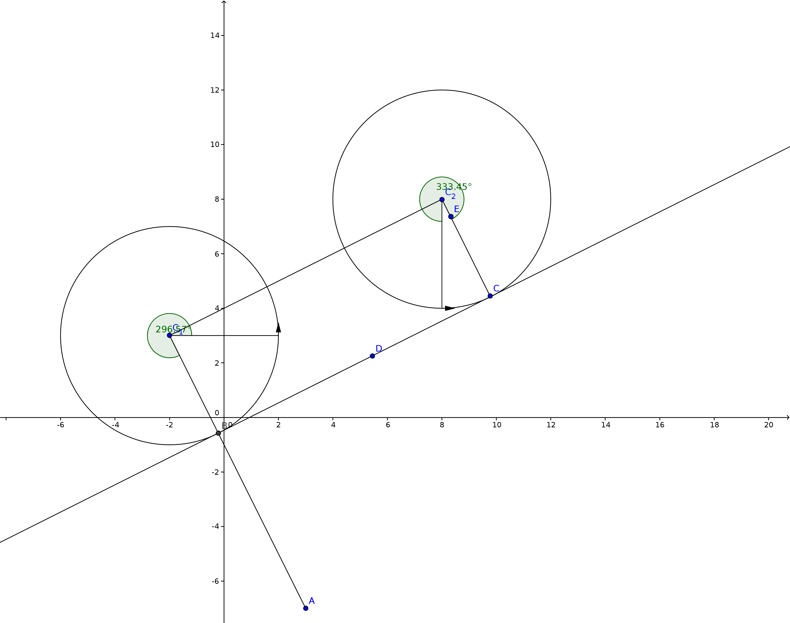
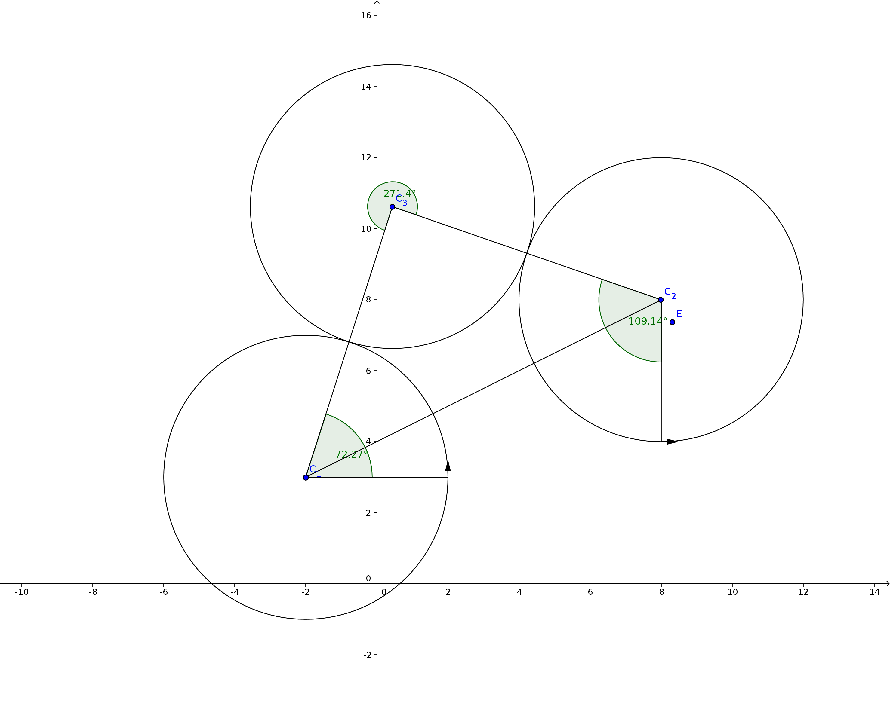
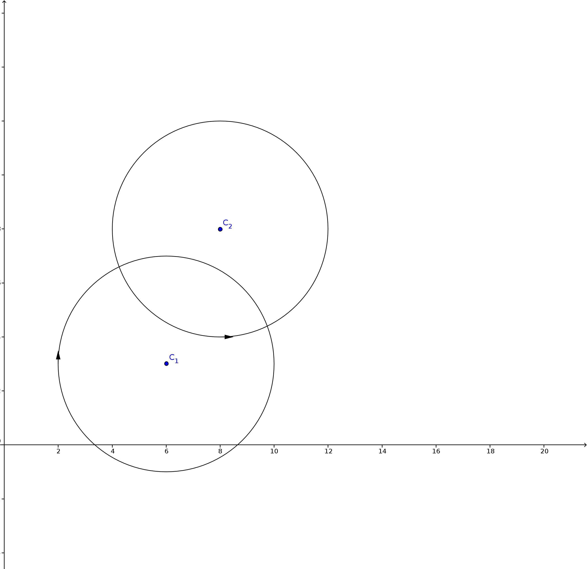

# Robotiks WS17/18

# Assignment 11

| Name | MatrNr | Mail |
|------|----------|-----|
| Sven Heinrichsen | 4780388 | s.heinrichsen@fu-berlin.de |
| Alexander Hinze-Huettl | 4578322 | hinze.alex@gmail.com |

__Repo:__ [https://github.com/al-eax/robotik_ws1718](https://github.com/al-eax/robotik_ws1718)

## 1)

We used this tool for visualization: [http://alexbeutel.com/webgl/voronoi.html](http://alexbeutel.com/webgl/voronoi.html)

## 2)

#### LSL

\(U=2*r*\pi=25.13\)

\(L_1 = \frac{296^\circ}{360^\circ} * U = 20.66\)

\(S = 11.18 \)

\(L_2 = \frac{333.45^\circ}{360^\circ} * U = 23.28\)

\(LSL = 55.12\)

#### LRL

\(L_1 =  \frac{72.27^\circ}{360^\circ} * U = 5.04\)

\(R =  \frac{271.4^\circ}{360^\circ} * U = 18.95\)

\(L_2 = \frac{109.14^\circ}{360^\circ} * U = 7.62\)

\(LRL = 31.61 \)

#### RSL
Both circles intercept. To reach the second car position there is no way to change the cars direction from right to left by one __Straight__ action.

