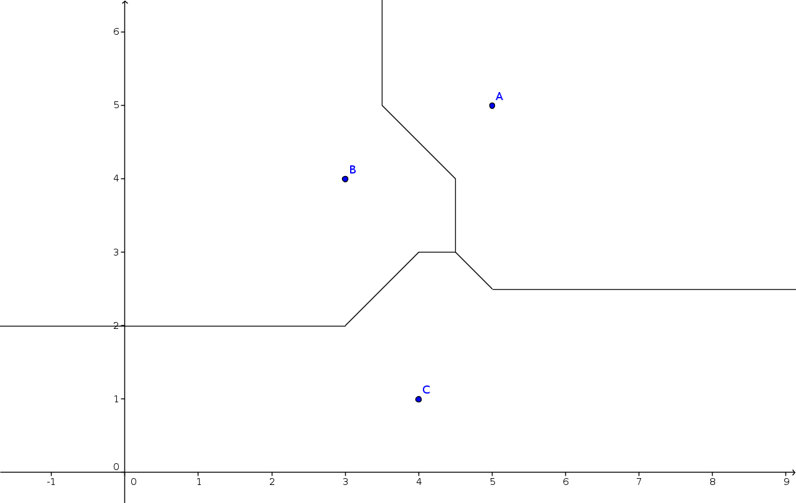
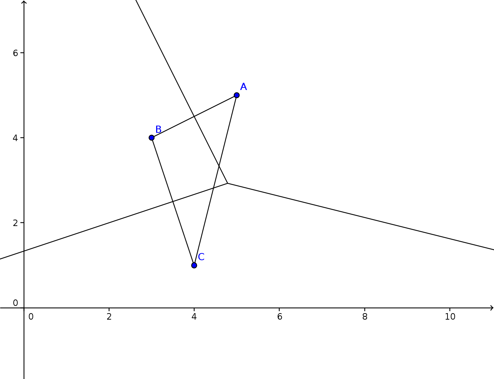

# Robotiks WS17/18

# Assignment 12

| Name |   MatrNr | Mail |
|------|----------|-----|
| Sven Heinrichsen | 4780388 | s.heinrichsen@fu-berlin.de |
| Alexander Hinze-Huettl | 4578322 | hinze.alex@gmail.com |

__Repo:__ [https://github.com/al-eax/robotik_ws1718](https://github.com/al-eax/robotik_ws1718)

## A* Tree

|     Step   |         Opend  {g+h}        |   Closed      |
|------------|---------------------------------------------|---------------------- |
|0           |  __H{0+19}__  |       |
|1           | __G(10+1)__, E{10+20}, D{10+35}, C{10+42}, | H{0+19}   |
|2           | __E{10+20}__, F{20+18}, D{10+35}, C{10+42}    | H{0+19}, G{10+1},   |
|3           | __F{20+18}__, D{10+35}, C{10+42}    | H{0+19}, G{10+1}, E{10+20} |
|4           | __B{30+9}__, D{10+35}, C{10+42}    | H{0+19}, G{10+1}, E{10+20}, F{20+18},   |
|5           | __A{40+0}__, D{10+35}, C{10+42}   | H{0+19}, G{10+1}, E{10+20}, F{20+18}, B{30+9} |

Shortest way under consideration of alphanumerical values: \(h \rightarrow g \rightarrow e \rightarrow f \rightarrow b \rightarrow a\).
This heuristic is __not__ optimistic. Some heuristics are higher than the actual path costs. Have a look at C to A. This means, the graph is not consistent.

A non consistent graph doesnt find the optimal path, as you can see.

## 2. Voronoi-Diagrams

##### l1 metric

##### l2 metric

## 3. Potential Fields

\(F_{G} = d_G^2 = \left( \sqrt{ (x-3)^2 + (x-4)^2 } \right)^2  = (x-3)^2 + (y-4)^2 \)

\(F_{O} = \frac{3}{d_O^2} = \frac{3}{(x-2)^2 + (y-3)^2} \)

##### derivation of \(F_G \)
\(F_{xG}'(x,y) = 2x-6\)

\(F_{yG}'(x,y) = 2y - 8\)

##### derivation of \(F_O \)
\(u = 3; u' = 0\)

\(v = (x-2)^2 + (y-3)^2\)

\(v_x' = 2x-2; v_y' = 2y-8 \)

\(F_{xO}'(x,y) = \frac{-3*(2x-2)}{ \left( (x-2)^2 + (x-4)^2 \right)^2 }\)

\(F_{yO}'(x,y) = \frac{-3*(2y-2)}{ \left( (x-2)^2 + (x-4)^2 \right)^2 }\)

##### force vectors
\(\vec{F_O} = (F_{xO}'(1,1), F_{yO}'(1,1))^T = (0,0)^T \)

\(\vec{F_G} = (F_{xG}'(1,1) , F_{yG}'(1,1))^T = (-4,-6)^T \)
