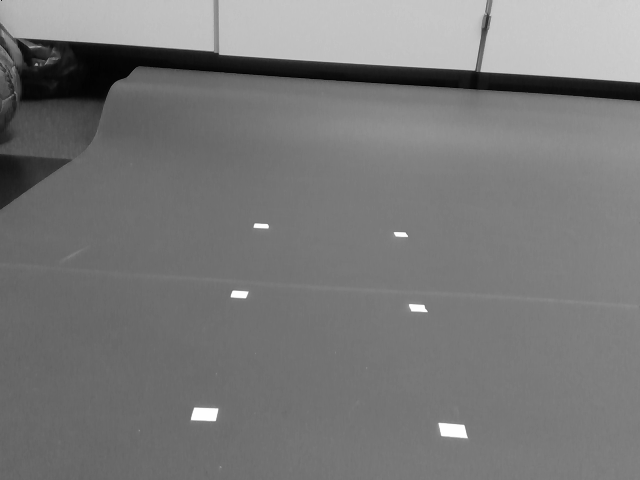
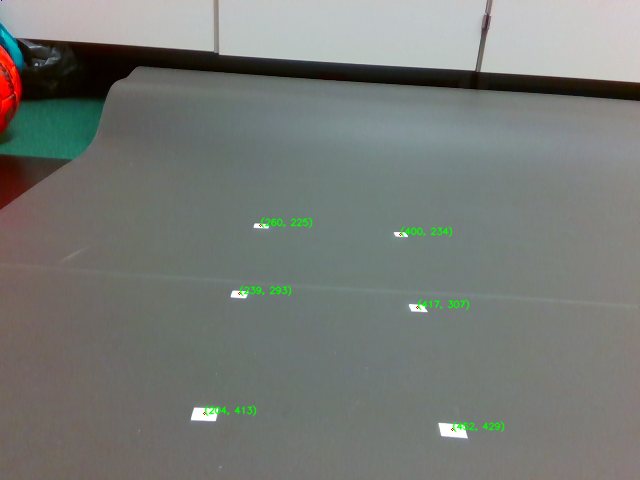

# Robotiks WS17/17

# Assignment 3

| Name | MatrNr | Mail |
|------|----------|-----|
|Rémi Toudic | 4318284 | remitoudic@gmail.com|
|Maximilian Mozen | 4705573 | max.mozen@gmx.de |
| Alexander Hinze-Huettl | 4578322 | hinze.alex@gmail.com |


### Connect to the model car via SSH

We created a file `hello_car_alex_long.txt` with current time and date `Fr, 10.Nov, 14.02`:


### Create a repository
We forked the project on github:

[https://github.com/al-eax/catkin_ws_user](https://github.com/al-eax/catkin_ws_user)


### Prepare the field


### Monochrome (grayscale) image

```py
def cameraRawCallback(data):
		global cv_input_image
		global bridge
		cv_input_image = bridge.imgmsg_to_cv2(data, "bgr8")
		#...
		cv_gray_image = cv2.cvtColor(cv_input_image, cv2.COLOR_BGR2GRAY)
		#...
		cv2.imwrite("cam_image_gray.png",cv_gray_image)
```



### Black and white image

```py

_, cv_binary_image = cv2.threshold(cv_gray_image,220,255,cv2.THRESH_BINARY)
#...
def pubImages(img_gray, img_bin):
    global bridge
    gray_scale_pub = rospy.Publisher("/gray_scale_img",Image,queue_size = 10)
    bin_pub = rospy.Publisher("/binary_img",Image,queue_size = 10)

    ros_image_gray = bridge.cv2_to_imgmsg(img_gray, "mono8") #mono8 1 channel = grayscale
    ros_image_bin = bridge.cv2_to_imgmsg(img_bin, "mono8")

    gray_scale_pub.publish(ros_image_gray)
    bin_pub.publish(ros_image_bin)

```


### find the white points in the image

We used OpenCVs `findContours` function and [image moments](http://opencv-python-tutroals.readthedocs.io/en/latest/py_tutorials/py_imgproc/py_contours/py_contour_features/py_contour_features.html) to calculate the centers:
```py
def getPoints(bin_image):
		image, contours, hierarchy = cv2.findContours(bin_image,1, 2)
		#...
		points = []
		for contour in contours:
				M = cv2.moments(contour)
				#...
				if M['m00'] != 0:
						cx = int(M['m10']/M['m00'])
						cy = int(M['m01']/M['m00'])
						points.append((cx,cy))
```




### Compute the extrinsic parameters


```py
model_points = np.array([(0,0,0), (20,0,0), (0,20,0),
												(20,20,0), (0,40,0) , (40,40,0)],
												 dtype = "double")
#...
camera_matrix = np.matrix( [[fx,0,cx],
													 [0,fy,cy],
													 [0,0,1]], dtype = "double")

distortion_params = np.array([[k1],[k2],[t1],[t2]], dtype = "double")

points = getPoints(cv_bin_image)
image_points = np.array(points,  dtype = "double")
(_, rvec, tvec) = cv2.solvePnP(model_points,image_points,camera_matrix,distortion_params)

```

We printed:

1. the 2d image coordinates
2. the rotation vector
3. the translation vector
4. the inverse of homogeneous
5. pitch, yaw and roll in deg


### Finding the camera location and orientation

we mostly translated the cpp code:

```py
#...
rotM,_ = cv2.Rodrigues(rvec)

inv_rmat = rotM.T
inv_tvec = -inv_rmat * tvec

yaw = math.atan2(inv_rmat[1][0] ,inv_rmat[0][0])
pitch = math.atan2(-inv_rmat[2][0], math.sqrt(inv_rmat[2][1]**2 + inv_rmat[2][2]**2))
roll = math.atan2(inv_rmat[2][1], inv_rmat[2][2])  
```

Unfortunately we are not sure, if our calculations are correct. The translation and the view angles make no sense.
