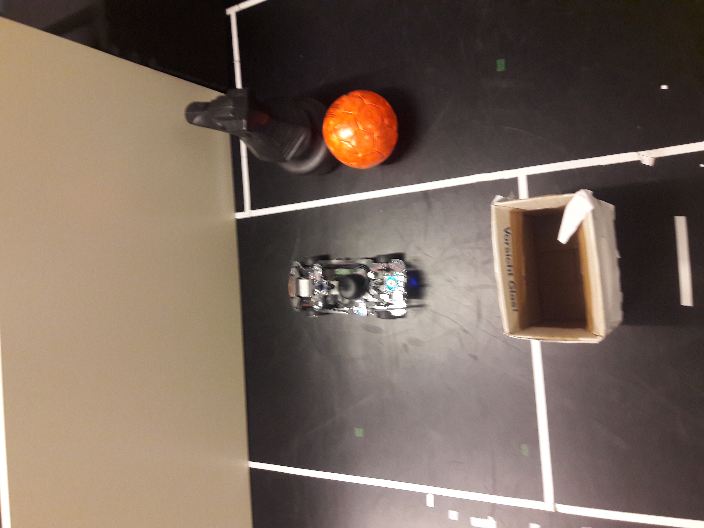
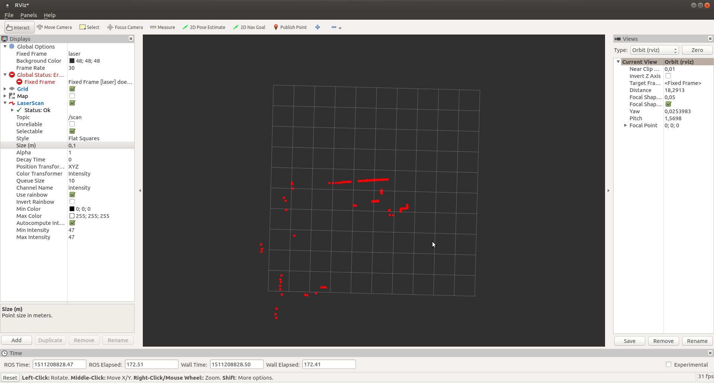
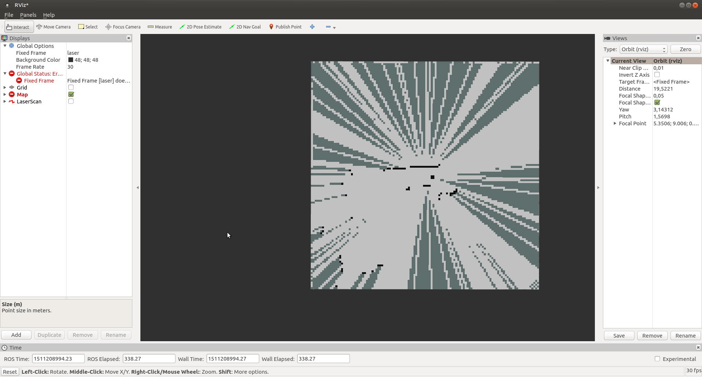

# Robotiks WS17/17

# Assignment 4


| Name | MatrNr | Mail |
|------|----------|-----|
|Rémi Toudic | 4318284 | remitoudic@gmail.com|
| Sven Heinrichsen | 4780388| s.heinrichsen@fu-berlin.de |
| Alexander Hinze-Huettl | 4578322 | hinze.alex@gmail.com |

We are the lost guys. Every one of us lost his group partner.

# 1.


We used a 2d vector rotation matrix to calculate the x and y of the  obstacle:

```py
e1 = np.array([[1.0],[0.0]])
vec = rotate(e1*lidar_len, lidar_angle)
setCell((vec[0]),(vec[1]),OBST)
```

finally we used the [Bresenham algorithm](http://www.roguebasin.com/index.php?title=Bresenham%27s_Line_Algorithm) to calculate the line of free cells from origin to the obstacle.


We visualized the laserscan and the OccupancyGrid:



You can see the desk in the front and the obstacles behind and on the right fo the car:

__laserScan__


__Map__



# 2.
We made a semi-automatic process to measure the distances `dl2,dr2` for 10° and 250° for each steering angle:

```py
angles = [0,30,90,120,150,179]
current_angle = 0

print "angle:" ,angles[current_angle]
pubSteering(angles[current_angle]) #set steering angle
rospy.sleep(5)
pubSpeed(100) #move the car
rospy.sleep(3)
pubSpeed(0) #stop the car
print_lidar = True #print lidar callback to measure dl2 dr2
pubSteering(100)
```
We placed the car 1m in front of two desks

We measured these values:

```py
d2 = [(1.37399995327, 1.64900004864),
      (1.38499999046, 1.59399998188),
      (1.38100004196, 1.40299999714),
      (1.41100001335, 1.36600005627),
      (1.47800004482, 1.33299994469),
      (1.65499997139, 1.38699996471)
      ]
```
Unfortunately we had problems to calculate the correct steering angles. You can see our attempt in the `ub4_2.py` file.

Finally we assumed that we calculated the correct angles and used polynomial interpolation for the mapping:

```py
def function_approx(angle):

    x=[0, 30, 60, 70,  90, 160,180]

    # our  intuitiv approximation ( assumed from our intuition )
    y=[0, 32, 65, 78, 100 , 165,200]

    # polynomimal approximation  (the set polynome to maximal degree)
    z = np.polyfit(x, y,6 )

    # evaluation of the
    angle_correction = np.polyval( z, angle)

    return angle_correction
```
Lets calculate some angles between the cells:
```
('turn in real world: ', 36.2367507920112)
              0    30    60     90    120    150    180
 real values  0  32.0  65.0  100.0  119.0  148.0  200.0

```
