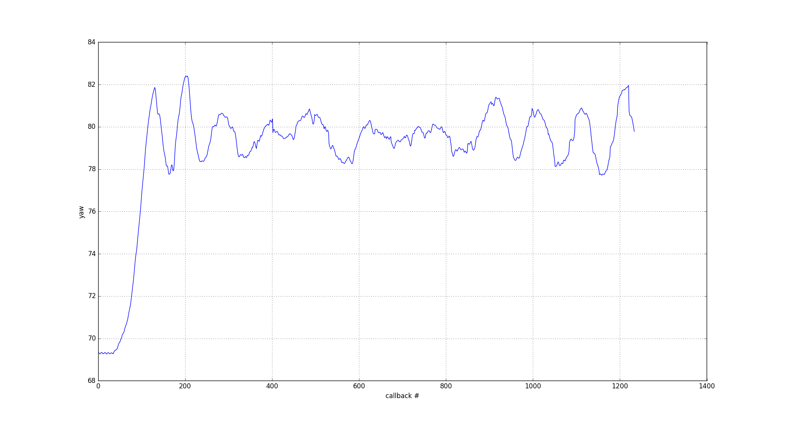
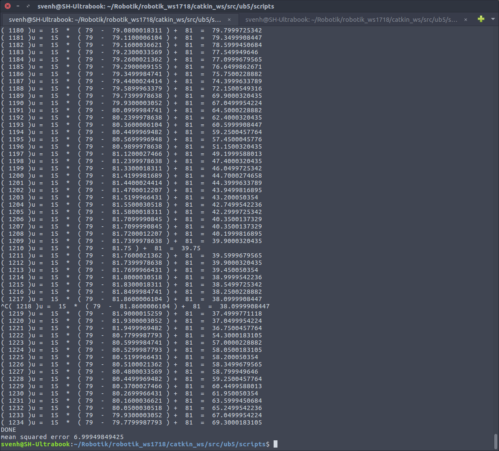
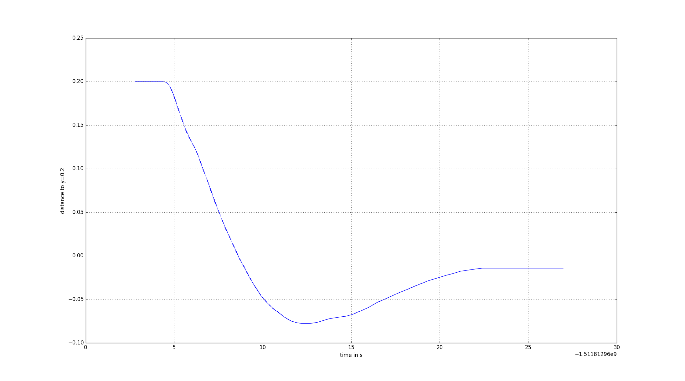
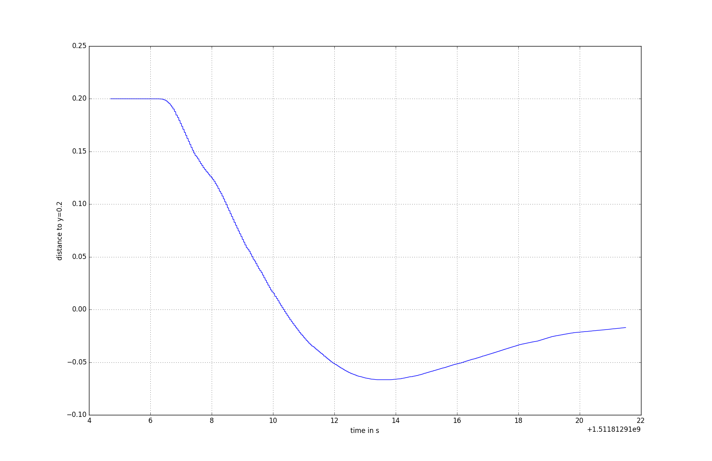
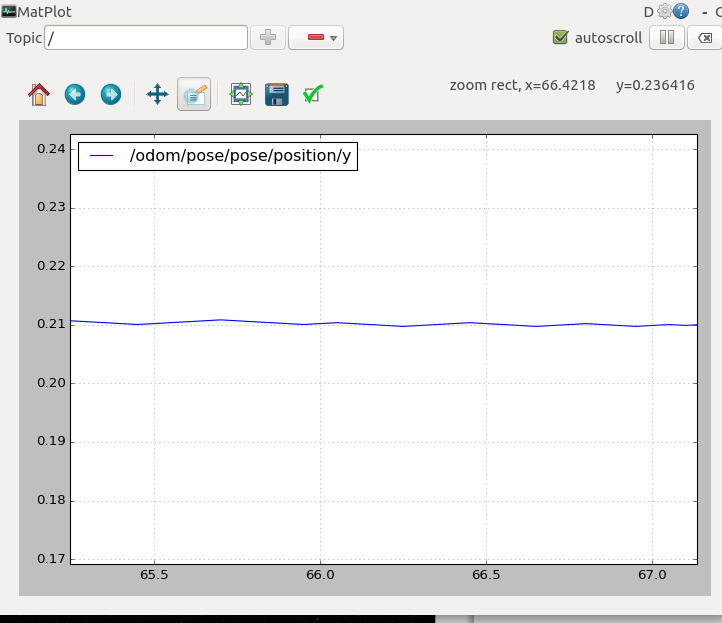
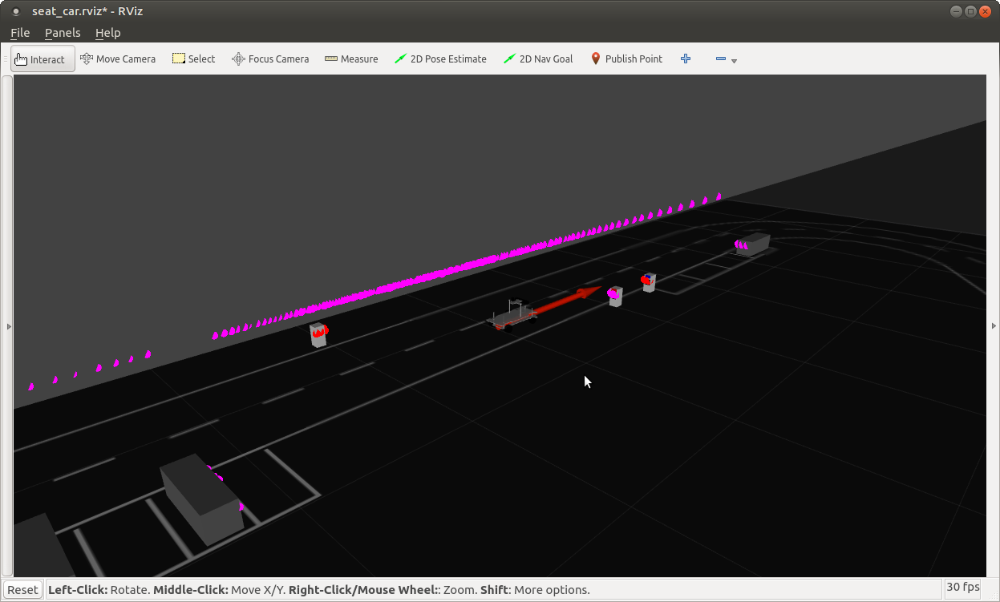
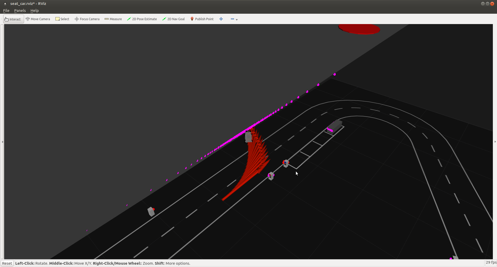
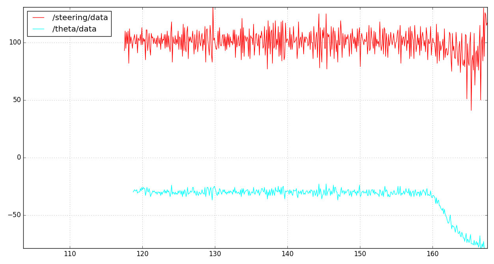
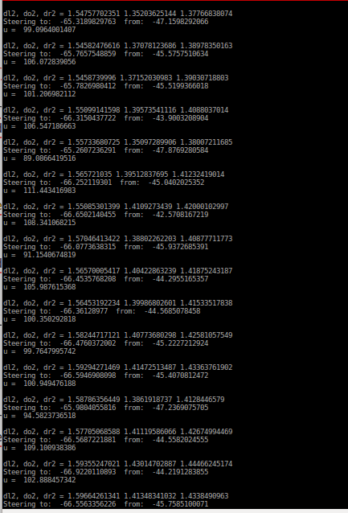

# Robotiks WS17/17

# Assignment 5


| Name | MatrNr | Mail |
|------|----------|-----|
|Rémi Toudic | 4318284 | remitoudic@gmail.com|
| Sven Heinrichsen | 4780388| s.heinrichsen@fu-berlin.de |
| Alexander Hinze-Huettl | 4578322 | hinze.alex@gmail.com |

__Repo:__ [https://github.com/al-eax/robotik_ws1718](https://github.com/al-eax/robotik_ws1718)

## Control a car on a straight lane using a heading sensor

We subscribed to the topic `/model_car/yaw`
We calculated `u` wit the given formular:

```py
u = KP *(desired_yaw - current_yaw) + CALIBRATED_ZERO_ANGLE
```

We switched between a real car and the gazebo simulator. For the real car we used higher weight values because of the limited space in the lab.

This is our plot of the current yaw against the callbacks for the real car with `KP = 15`:



After 1234 callbacks we had a mean suared error of `7`. The car starts with a yaw of 70° and oscillates around 79°:



## Control a car on a trajectory via odometry

For this task, we subscribed the `/odom` topic. We also recorded the timestamp in `t` and the difference between current y and desired y in `odom_arr` to calculate the derivative:

```py
def do_PDC(current_y, desired_y):
    derivative = 0
    if len(odomy_arr) > 2:
        derivative = (odomy_arr[-1]-odomy_arr[-2]) / (t[-1]-t[-2])

    u = -KP *(desired_y - current_y) - KD * (derivative) + CALIBRATED_ZERO_ANGLE
    pubSteering(u)
```

For the real cat we had to use high weight values `KP = 300, KD = 100` to see acceptable results over a few meters.
Here are two plots we generated with the real car. They show the distance between `0.2 - current_y`  against the time:



finally a plot of the same programm using the gazebo:


Output:
```
...
u= 2.9 *( 0.2 - 0.201403176746 )  + 2.6 * - 0.0153677153998 = 80.9558835035
u= 2.9 *( 0.2 - 0.201406393693 )  + 2.6 * - 0.0157934304967 = 80.9528238898
u= 2.9 *( 0.2 - 0.20140961064 )  + 2.6 * - 0.0153677153998 = 80.9587496072
u= 2.9 *( 0.2 - 0.201412827587 )  + 2.6 * - 0.0168380043108 = 80.9415971952
u= 2.9 *( 0.2 - 0.201416044534 )  + 2.6 * - 0.000204371124299 = 80.9957149158
u= 2.9 *( 0.2 - 0.201419261482 )  + 2.6 * - 0.000204653206481 = 80.9436018456
u= 2.9 *( 0.2 - 0.201422478429 )  + 2.6 * - 0.000204927768309 = 80.9037975928
u= 2.9 *( 0.2 - 0.201425695376 )  + 2.6 * - 0.0291632293682 = 80.8914564932
u= 2.9 *( 0.2 - 0.201428912323 )  + 2.6 * - 0.0389216945799 = 80.8872449446
u= 2.9 *( 0.2 - 0.20143212927 )  + 2.6 * - 0.0413891230706 = 80.8858737194
u= 2.9 *( 0.2 - 0.201435346217 )  + 2.6 * - 0.0400381427924 = 80.9007658951
```

## Closing the loop: Control a car using the lidar sensor to keep its distance to a wall

We subscribed to the `/scan` topic and wrote a simple mapping function to get the distance for 80° and 100° for `dr2,dl2`.
From there values and the given constants we calculated `do2`:
```py
alpha = alpha * math.pi / 180.0 #deg to rad
t = math.sqrt(dr2**2 + dl2**2 - 2 * dl2 * dr2 * math.cos(alpha))
phi2 = math.asin(dr2* math.sin(alpha) / t)
do2 = - math.sin(phi2) * dl2
```
With these three values we tried to calculate the angled `theta` and `theta_stern`:
```py
thetal2 = math.asin(do2 / dl2)
theta = thetal2 - alpha
cy = do2 + math.sin(theta) * s
thetaStar = math.atan2(p - cy, l) * 180 / math.pi
theta = theta * 180 / math.pi - 90
```
We got stable values for our `dl2,dr2,do2` but crazy values for `theta,theta_stern`.
We tried to calculate the PD controller anyway:

```py
deltaHeading = thetaStar - theta
derivative = 0
if len(heading_arr) > 1:
  derivative = (heading_arr[-1] - heading_arr[-2]) / (t[-1] - t[-2])
u = - KP * deltaHeading - KD * derivative + CALIBRATED_ZERO_ANGLE
```

To test this code, we placed an obstecla in the gazebo world:


 We get valid values for `dl2, dr2, do2` but the calculation for the steering fails:


Here is the plot of the steering angle and the theta angle. You can see the car starting af 160:


and a short log of our `dl2,dr2,do2,u` and angles:


