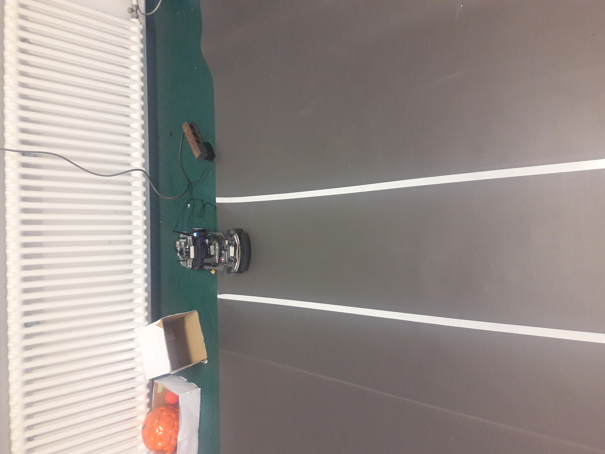
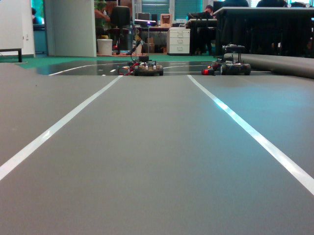
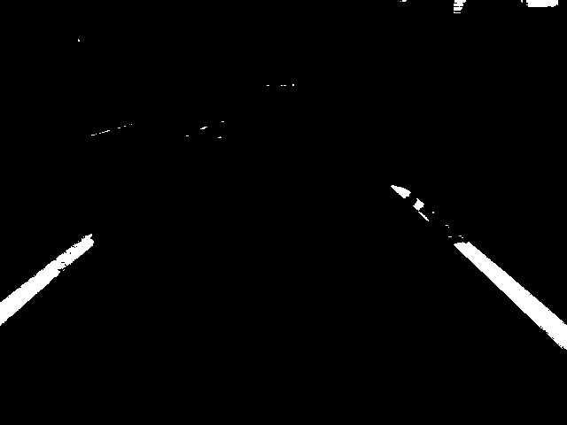
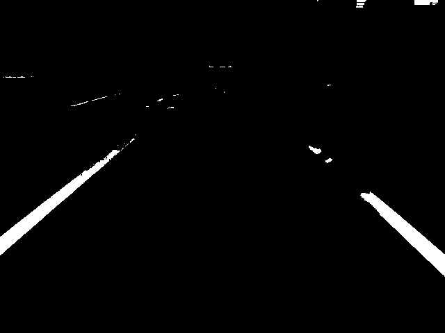
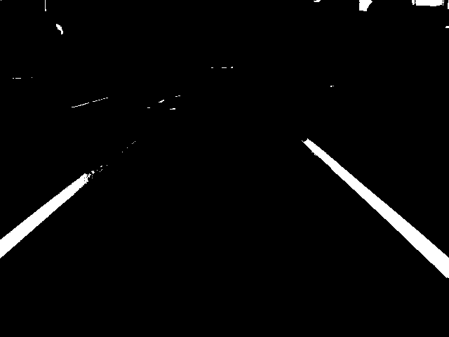
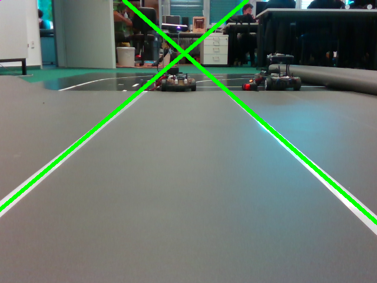
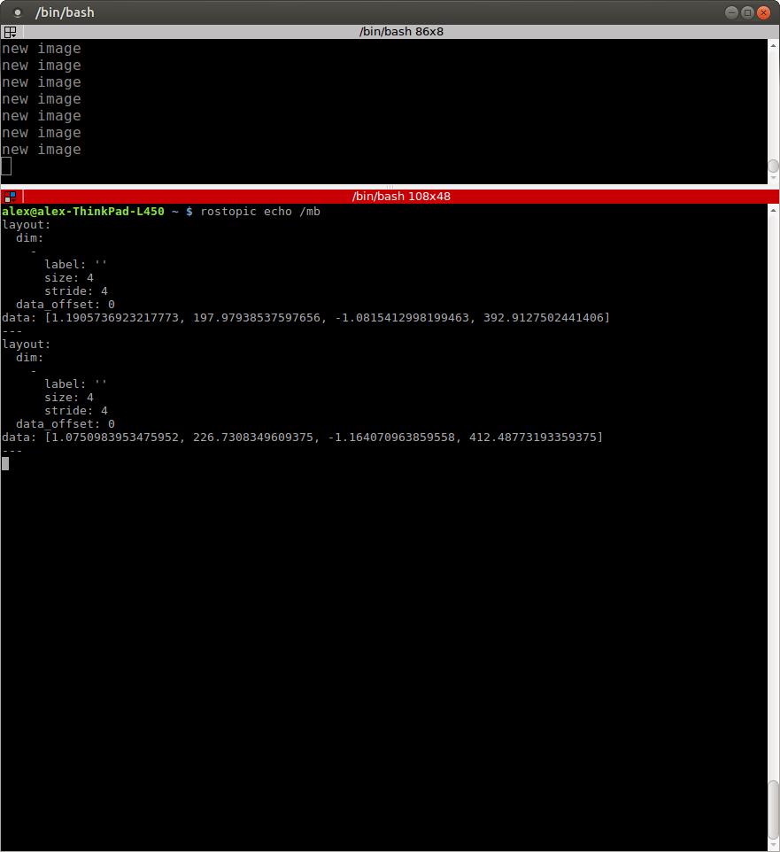
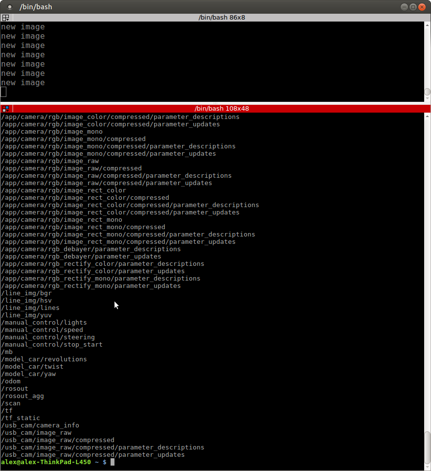

# Robotiks WS17/18

# Assignment 6

| Name | MatrNr | Mail |
|------|----------|-----|
| Sven Heinrichsen | 4780388| s.heinrichsen@fu-berlin.de |
| Alexander Hinze-Huettl | 4578322 | hinze.alex@gmail.com |

__Repo:__ [https://github.com/al-eax/robotik_ws1718](https://github.com/al-eax/robotik_ws1718)

## 1.​ Setting​ ​up​ ​the​ ​field


## 2.​ ​Lane​ ​segmentation

The YUV color space seems to work best. This is because it can include every color for a specific white value. HSV works similarly but it is hard to find the right saturation value so that the color share stays low enough. RGB does not work well because the gray value correlates directly with the color shares.

Here is an example that shows, that YUV worked better for us. Take a look at the brighter ground on the right:



__RGB__



__HSV__



__YUV__



At first, we defined the color ranges to generate a mask for each color space. The method `cv2.inRange` returns this mask with all pixels in our range set to \(255)\.

## 3.​ ​ Getting​ ​the​ ​line​
From the binary image of task 2 we set the top 20% of the image to black, to remove the noise.

Then we used `cv.findContours` to get the two white segments with most pixels:
```py
im2, contours, hierarchy = cv2.findContours(img, cv2.RETR_TREE, cv2.CHAIN_APPROX_SIMPLE)
contours = sorted(contours, key = cv2.contourArea, reverse = True)
```

We apply the `linear_model.RANSACRegressor()` from _scikit-learn_ on our segments to get the line parameters \(m,b)\:

```py
def do_ransac_on_contur(contur):
    ransac = linear_model.RANSACRegressor()
    X = []
    Y = []
    for pxl in contur:
        X.append([pxl[0][1]])
        Y.append([pxl[0][0]])
    ransac.fit(X, Y) #build classifier
    b = ransac.estimator_.intercept_
    m = ransac.estimator_.coef_
    return (b,m)
```

Then we can get the start and end points for both lines by applying \( f(0) , f(image\_width))\ for \(f(x) = x*m+b )\ to draw both lines:

```py
b1,m1 = do_ransac_on_contur(line_segments[0])#get line parameters m,b
b2,m2 = do_ransac_on_contur(line_segments[1])

L1 = mb_to_tupel(b1,m1, img.shape[1]) # m,b to start and end point in image
L2 = mb_to_tupel(b2,m2, img.shape[1])

cv2.line(original_img, L1[0] , L1[1],(0,255,0),5)
cv2.line(original_img, L2[0] , L2[1],(0,255,0),5)
```

Here is the output image:



Finally we published the line \([m1,b1,m2,b2])\ by using a `Float32MultiArray` to store multiple values:



Here is an image of our published topics:

* /line_img/bgr
* /line_img/hsv
* /line_img/yuv
* /line_img/lines
* /mb


