# Robotiks WS17/18

# Assignment 9

| Name | MatrNr | Mail |
|------|----------|-----|
| Sven Heinrichsen | 4780388 | s.heinrichsen@fu-berlin.de |
| Alexander Hinze-Huettl | 4578322 | hinze.alex@gmail.com |

__Repo:__ [https://github.com/al-eax/robotik_ws1718](https://github.com/al-eax/robotik_ws1718)

## 1) Monte Carlo Particle Filter - Initialize a particle cloud

Here our code to create random particles:

```py
arena_x = 10.0/2.0
arena_y = 10.0/2.0
def initialize_pose_array():
    global pose_array
    pose_array = []
    for i in range(100):
        x = random.uniform(-arena_x, arena_x)
        y = random.uniform(-arena_y, arena_y)
        yaw = random.uniform(-math.pi, math.pi)
        pose_array.append(get_pose(x,y,yaw))
```

Here a picture of 100 random generated particles:
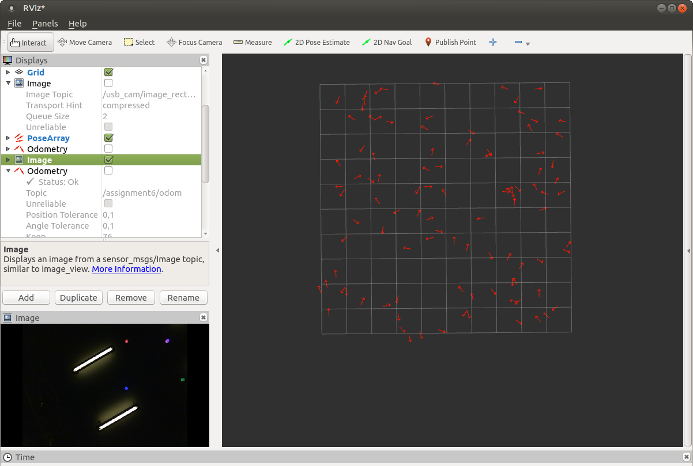

## 2) Propagation with Odometry

Have a look at our `odom_callback` function.
Here two pictures of the distribution between a few iterations:
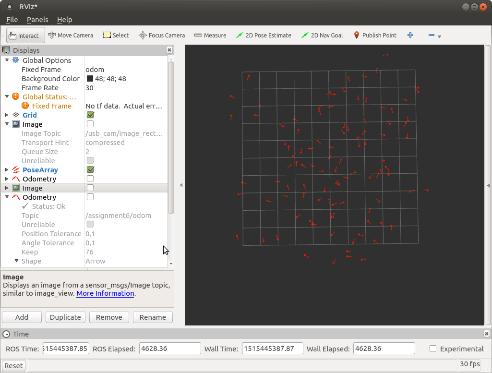
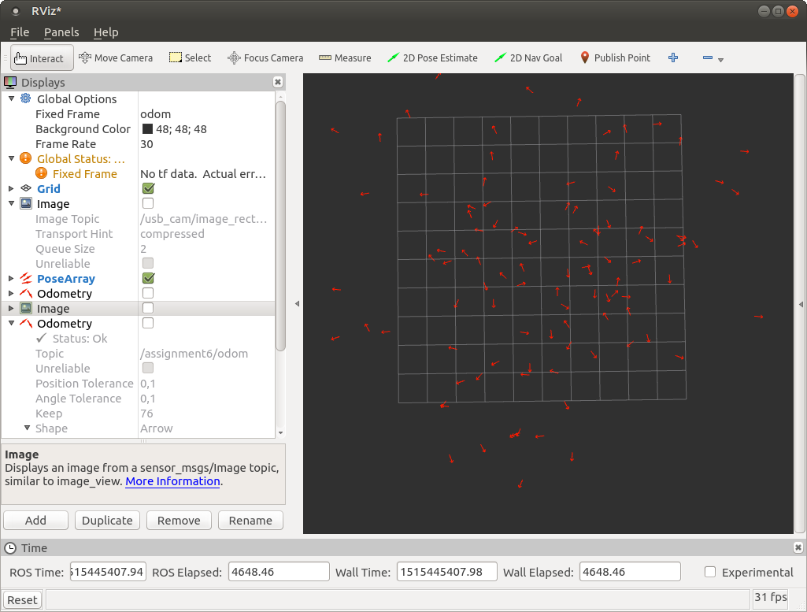


## 3) Calculate weights for each particle - with Sensory Data

We used a low standard deviation of 0.1 which leads to high weight diffs and hard resamplings into a few cells.

We used the `BalloonDetector` from KVV solution to localize the balloons and calculate the angles. Have a look at our `calc_weight` function.


## 4) Resample, Generate a new Particle Set

Resampling steps with a high standard deviation of 1000 particles:

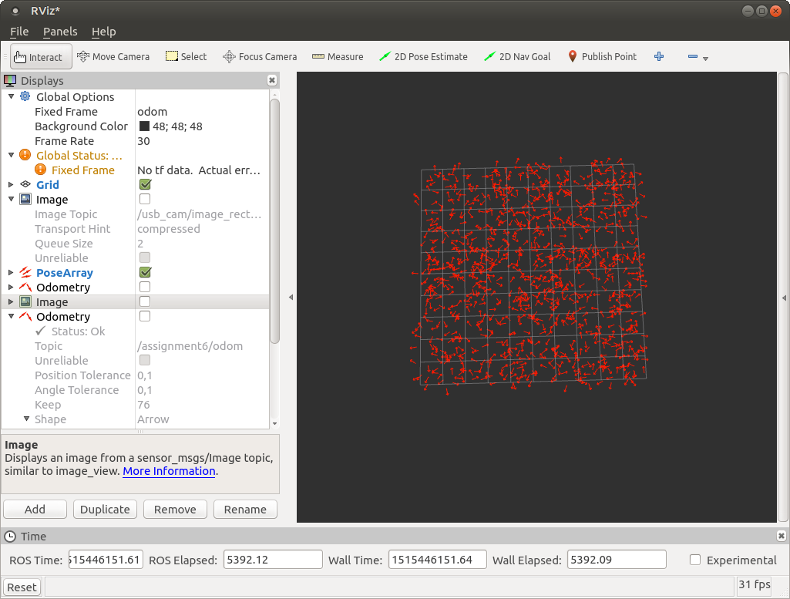
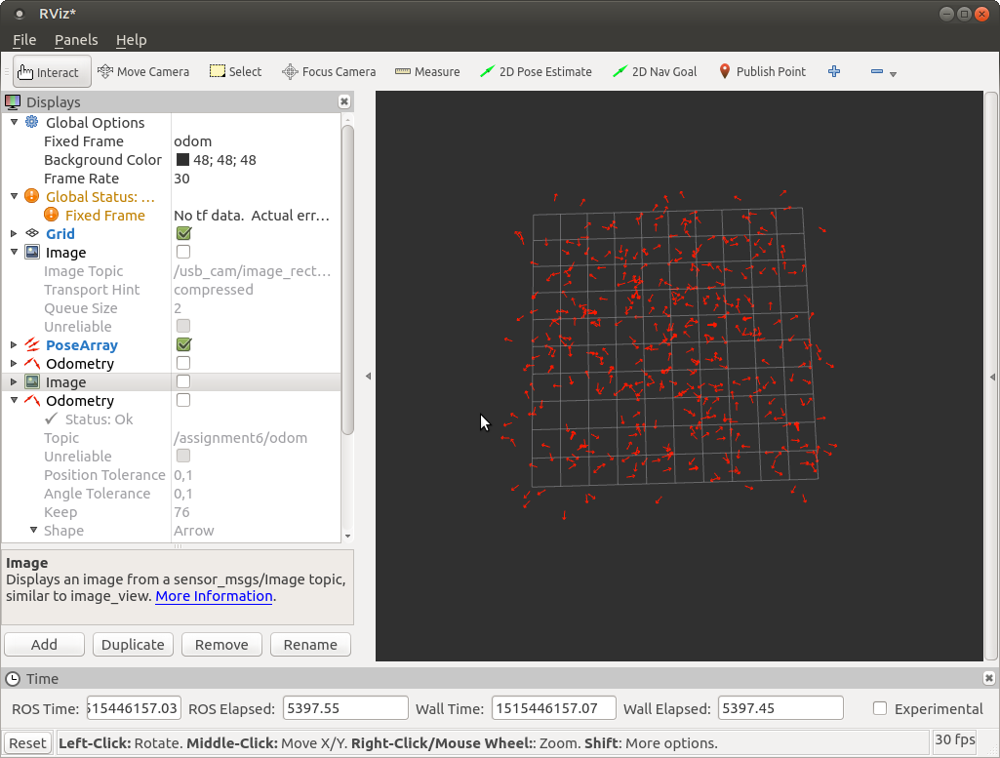
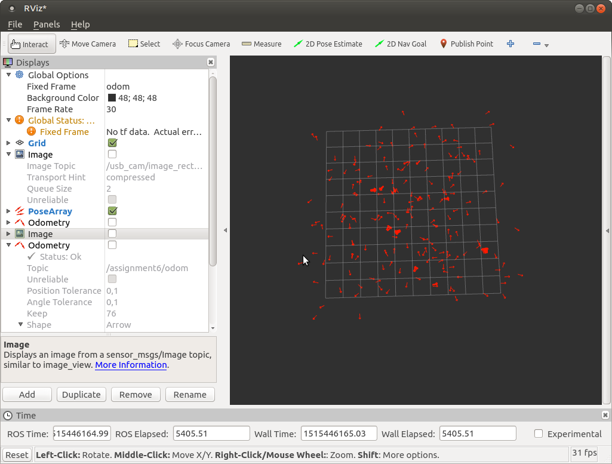
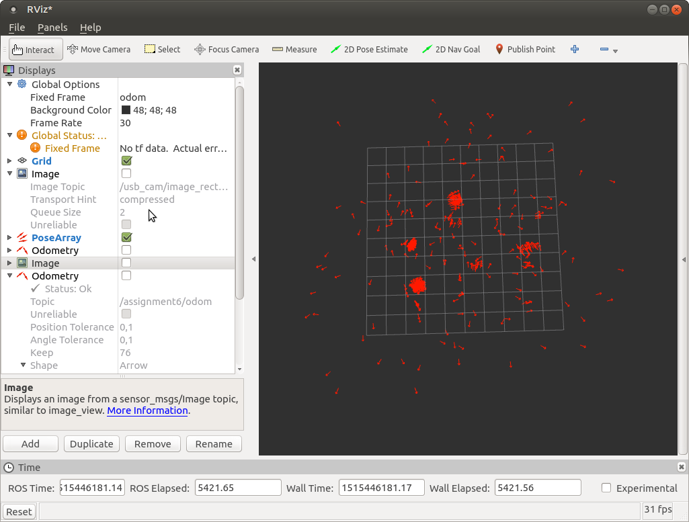

## 5) Calculate the Position

Here some pictures of our odometry (green) and cars odometry (red):

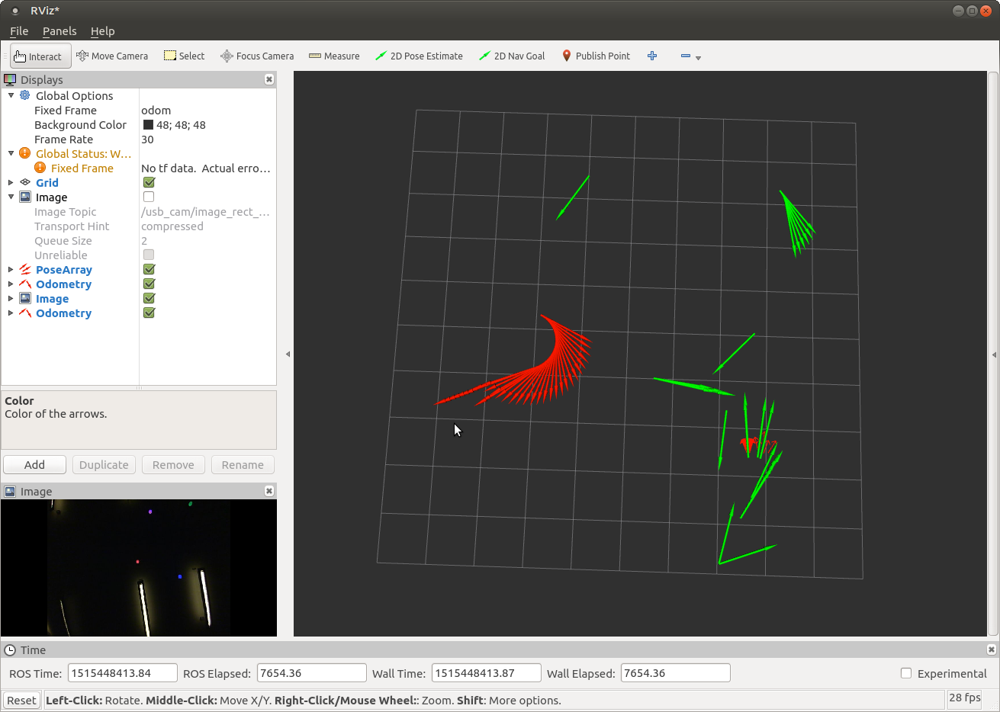
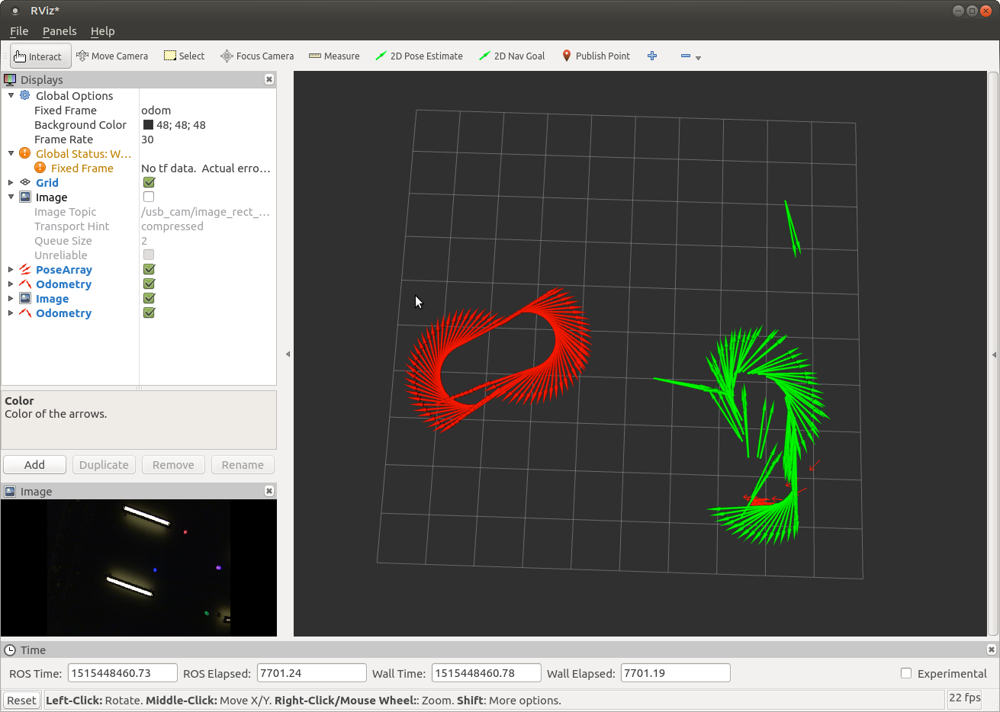
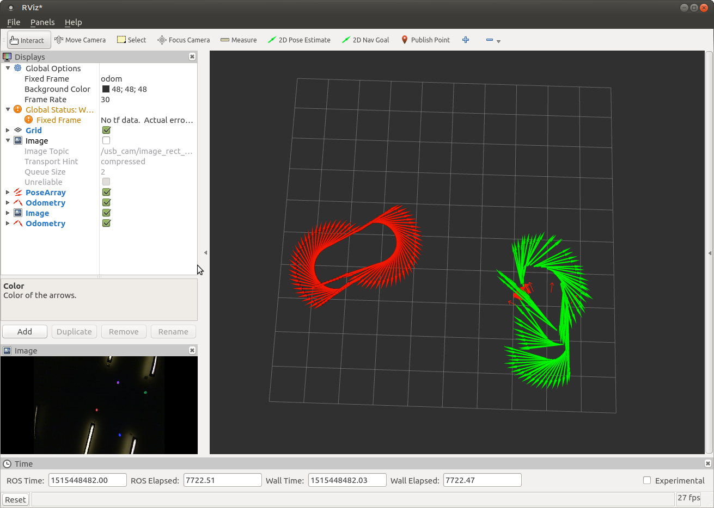

And here a plot of the coordinates:
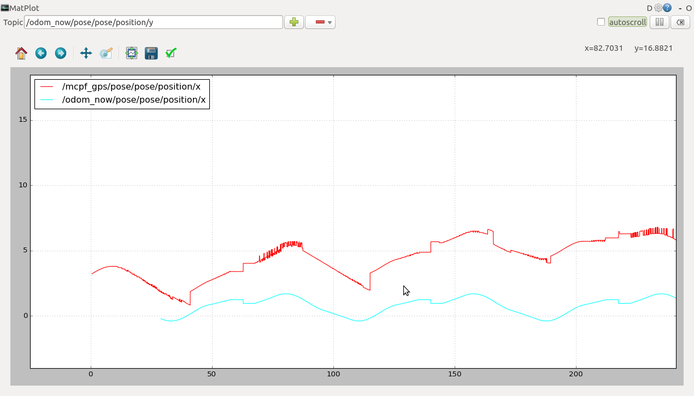
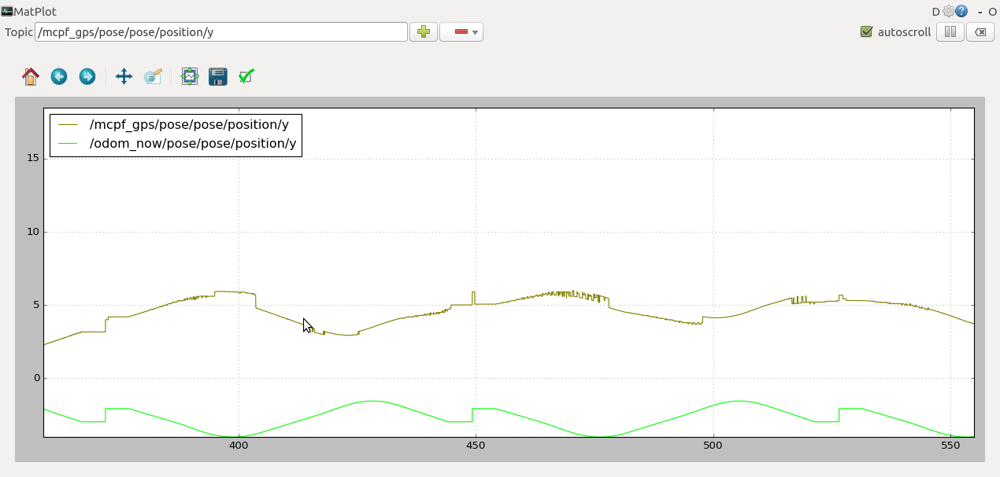
